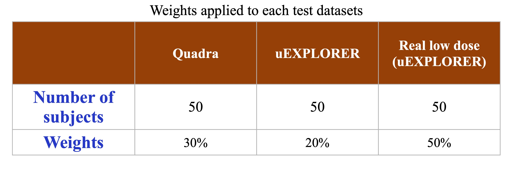
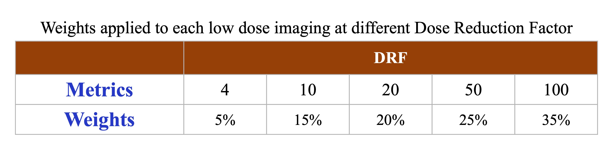
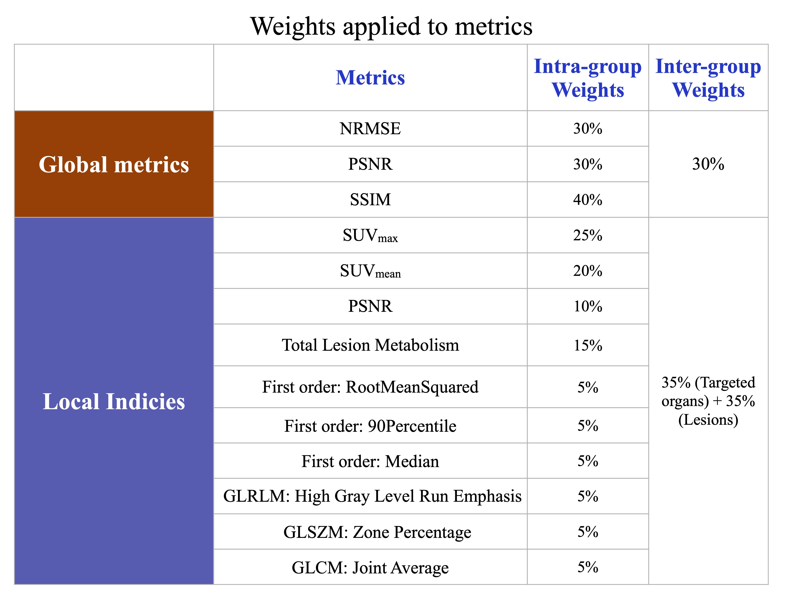

## Metrics
- Normalized root mean squared error (NRMSE), peak signal-to-noise ratio (PSNR) and structural similarity index measurement (SSIM) as global physical metrics.
- Sphere volume of interest (VOI) delineated within targeted organs (liver, kidney and heart). Percentage error of clinical imaging parameters including SUVmean, SUVmax, total lesion metabolism (TLM), as well as the most relevant radiomics features (GLRLM: High Gray Level Run Emphasis, GLSZM: Zone Percentage, GLCM: Joint Average, First order: RootMeanSquared, First order: 90Percentile, First order: Median), as well as local PSNR will be calculated between recovered images to the full-dose images.

Evaluation Code: [https://drive.google.com/file/d/1n2n1mqFz_QCP4G3A9pXk88TOrcdiWUNi/view?usp=sharing](https://drive.google.com/file/d/1n2n1mqFz_QCP4G3A9pXk88TOrcdiWUNi/view?usp=sharing)

## Ranking

Team rankings are computed using weighted scores from each evaluation metric. We will calculate measures using python scripts. Evaluation code will be available together with training dataset so teams can test first. Detailed weights of each metrics as listed in the tables below:

  

  

  

